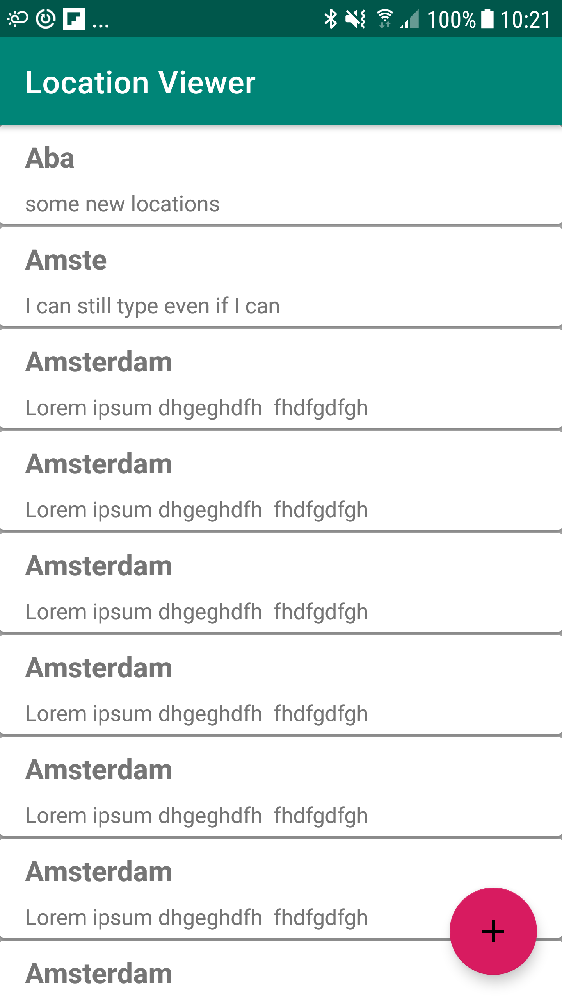
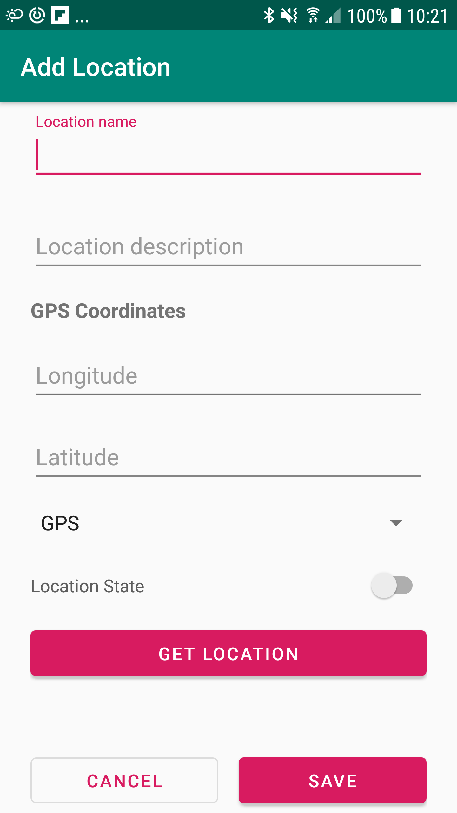
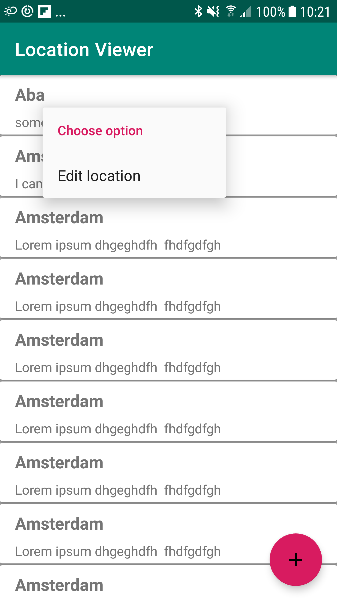
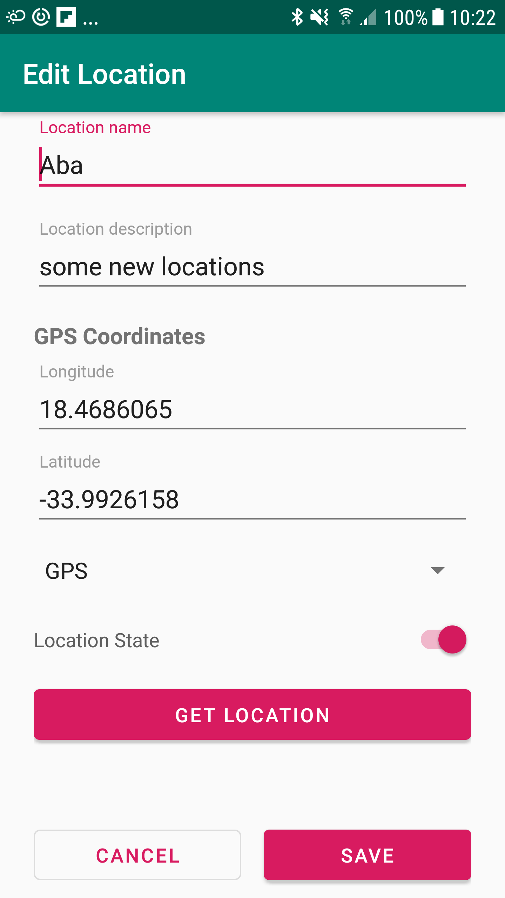

# LocationViewer
-
## Introduction
This is an application to capture location data. It has the following features

# Features
1. View Locations in a list
2. Store locations data
3. Edit location data
4. Fetch GPS coordinates 
5. Fetch weather information (temperature) for the location.

# Screenshots
### 1. Location list

### 2. Add Location

### 3. Edit location

## Components used
1. Android Architecture Components
	- Paging
	- Room
	- Lifecycle (LiveData, ViewModel)
	- Databinding
2. Dagger Dependency Injection
3. Retrofit
4. RxJava
5. Moshi converter
6. MVVM architecture

